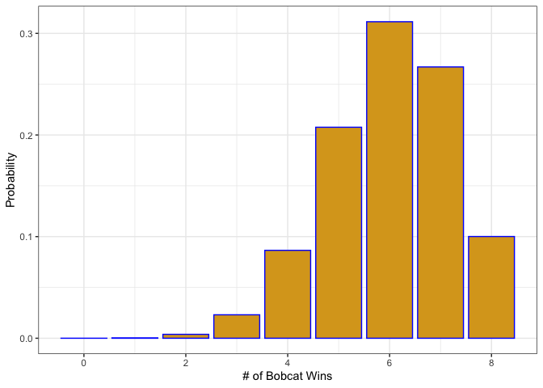
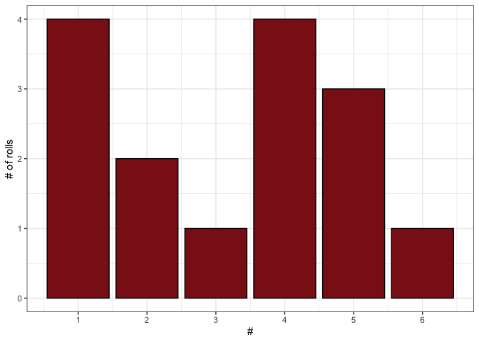
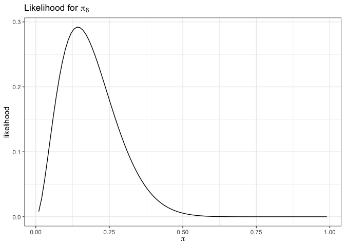

# Lab 1: Key


#### Question 1.

Given what we observed in the class activity it seems unlikely that MSU
and the University of Montana are evenly matched in football. Let’s
assume that outcomes of football games can be modeled with a binomial
distribution where $\pi = \frac{3}{4}$

##### 1.1 Explain - to a football fan - what $\pi$ means. (2 points)

This is the probability that the bobcats would win an individual game.

##### 1.2 Estimate the probability that MSU won 6 of 8 games. (2 points)

``` r
dbinom(6,8,.75)
```

    [1] 0.3114624

##### 1.3 Estimate the probability that UM won 6 of 8 games. (2 points)

``` r
dbinom(6, 8, .25)
```

    [1] 0.003845215

##### 1.4 Create a figure to show the probability that MSU won 0, 1, …, 8 (4 points)

``` r
library(tidyverse)
tibble(wins = 0:8,
       prob = dbinom(0:8, 8, .75)) |>
  ggplot(aes(y = prob, x = wins)) +
  geom_col(color ='blue', fill = 'goldenrod') +
  ylab('Probability') +
  xlab("# of Bobcat Wins") + 
  theme_bw() 
```



##### 1.5 Simulate the next ten games in the series, how many did MSU win? (2 points)

``` r
set.seed(08282025)
msu_wins <- rbinom(n = 1, 10, .75)
```

MSU wins 8 games out of 10.

#### Question 2.

At the start of class today, everyone rolled a die and recorded the
value on the marker board.

##### 2.1 What statistical probability distribution can be used to model these outcomes? (2 points)

A multinomial distribution

##### 2.2 What are are the parameters in the distribution stated in the answer to q 2.1? (2 points)

$\pi_1, ..., \pi_6$, the probabilities of each outcome

##### 2.3 Create a figure that shows the outcomes of these rolls. (4 points)

``` r
library(tidyverse)
tibble(rolls = sample(6, 15, replace = T)) |>
  ggplot(aes(x = rolls)) +
  geom_bar(color ='black', fill = 'firebrick4') +
  scale_x_continuous(breaks = 1:6, labels = as.character(1:6)) +
  ylab('# of rolls') +
  xlab('#') +
  theme_bw() 
```



##### 2.4 Create a figure that shows the likelihood of rolling a 6. (4 points)

``` r
pi_vals <- seq(.01, .99, by = .01)
like_vals <- dbinom(2, 14, pi_vals)
tibble(pi = pi_vals, 
       likelihood = like_vals) |>
  ggplot(aes(y = likelihood, x = pi)) + 
  geom_line() +
  theme_bw() +
  xlab(expression(pi)) +
  ggtitle(expression(paste("Likelihood for ", pi[6]))) 
```



##### 2.5 Calculate the MLE of rolling a 6 along with an uncertainty interval. (2 points)

``` r
binom.test(11, 14, p = .5, alternative = "greater")
```


        Exact binomial test

    data:  11 and 14
    number of successes = 11, number of trials = 14, p-value = 0.02869
    alternative hypothesis: true probability of success is greater than 0.5
    95 percent confidence interval:
     0.5343434 1.0000000
    sample estimates:
    probability of success 
                 0.7857143 

##### 2.5 Do you think it is likely that the probability of rolling a 6 is \$? Why or why not? (2 points)

Unlikely

##### 2.6 What would be your best guess for the MLEs for all parameters in the model? (2 points)

The number of success / total number of rolls

##### 2.7 Do you think it is likely that we are using fair dice (equal probability of rolling any number)? Why or why not? (2 points)

likely not
