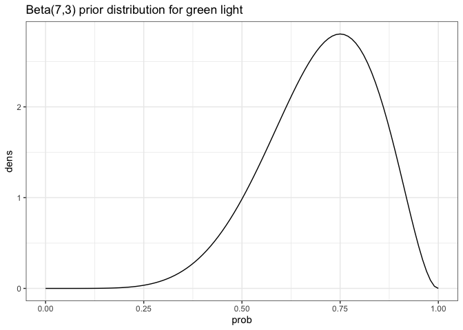
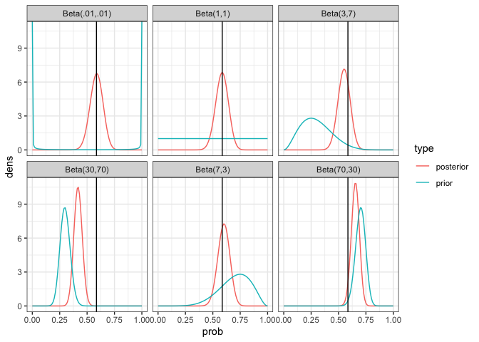

# Lab 2: Key


#### Question 1.

Suppose Curtis collected data on the stop light on 19th and main. In
particular, he took 70 trips through the intersection and recorded
whether the light was green (success) or not.

##### 1.1 Specify, plot, and justify a beta prior that matches your belief about the probability that you will have a green light at the intersection. (4 points)

``` r
p_seq <- seq(0, 1, by = .01)

tibble(dens = dbeta(p_seq, 7, 3),
       prob = p_seq )|>
  ggplot(aes(y= dens, x = prob)) +
  geom_line() + 
  theme_bw() +
  ggtitle('Beta(7,3) prior distribution for green light')
```



I’d expect to get through the light about 70% of the time, but want to
allow a fair amount of uncertainty in that guess. So I’ve selected a
Beta(7, 3) distribution.

##### 1.2 Assume Curtis got green lights on 41 of his trips. Use `binom.test()` to report an MLE and 95% uncertainty interval for the proportion of green lights (4 points)

Our MLE is 41 / 70 = 0.59.

``` r
binom.test(41, 70)
```


        Exact binomial test

    data:  41 and 70
    number of successes = 41, number of trials = 70, p-value = 0.1882
    alternative hypothesis: true probability of success is not equal to 0.5
    95 percent confidence interval:
     0.4616616 0.7022790
    sample estimates:
    probability of success 
                 0.5857143 

##### 1.3 Update your figure from Q1.1 to add the posterior distribution while keeping the prior distribution, given 41 green lights. Include a 95 uncertainty interval on the figure. (4 points)

``` r
p_seq <- seq(0, 1, by = .01)

tibble(dens = dbeta(p_seq, 7, 3),
       prob = p_seq )|>
  ggplot(aes(y= dens, x = prob)) +
  geom_line() + 
  theme_bw() +
  ggtitle('Beta(7,3) prior distribution for green light')
```


##### 1.4 Assume others used the following prior distributions. Create a figure (faceted or overlaid curves?) showing the priors and posteriors in these situations (4 points)

- Beta(.01, .01)
- Beta(1, 1)
- Beta(7, 3)
- Beta(3, 7)
- Beta(70, 30)
- Beta(30, 70)

``` r
n <- length(p_seq)
tibble(dens = c(dbeta(p_seq, .01, .01),
                dbeta(p_seq, 1, 1),
                dbeta(p_seq, 7, 3),
                dbeta(p_seq, 3, 7),
                dbeta(p_seq, 70, 30),
                dbeta(p_seq, 30, 70),
                dbeta(p_seq, .01 + 41, .01 + 29),
                dbeta(p_seq, 1 + 41, 1 + 29),
                dbeta(p_seq, 7 + 41, 3 + 29),
                dbeta(p_seq, 3 + 41, 7 + 29),
                dbeta(p_seq, 70 + 41, 30 + 29),
                dbeta(p_seq, 30 + 41, 70 + 29)),
       prob = rep(p_seq, 12 ),
       type = c(rep('prior', 6 * n), rep('posterior', 6 * n)),
       prior = c(rep(c('Beta(.01,.01)',
                     'Beta(1,1)',
                     'Beta(7,3)',
                     'Beta(3,7)',
                     'Beta(70,30)',
                     'Beta(30,70)'), each = n),
       rep(c('Beta(.01,.01)',
                     'Beta(1,1)',
                     'Beta(7,3)',
                     'Beta(3,7)',
                     'Beta(70,30)',
                     'Beta(30,70)'), each = n)))|>
  ggplot(aes(y = dens, x = prob, color = type))+
  geom_line() +
  facet_wrap(.~prior)+
  theme_bw() +
  geom_vline(xintercept = 41 / 70)
```



##### 1.5 Given the results from the previous questions, which method of estimation and uncertainty interval do you prefer? (4 points)

your choice

#### Question 2.

During lab 1, we all rolled a die at the beginning of class.

     [1] 6 2 6 2 2 2 6 3 3 6 6 1

The rolls ended up with the following outcomes 6, 2, 6, 2, 2, 2, 6, 3,
3, 6, 6, 1. We stated that a multinomial distribution could be used to
model these outcomes.

##### 2.1 What are are the parameters in the multinomial distribution? How do we interpret these parameters? (2 points)

$\pi_1, ..., \pi_6$, the probabilities of each outcome (rolling a 1 … 6)

##### 2.2 Assume that we will use a Dirichlet prior distribution with all $\alpha_i = 1$. What would be your prior mean for all of the parameters in the multinomial distribution? (2 points)

This is a uniform distribution, so the mean would be $\frac{1}{6}$. Note
there are other distributions with the same mean but different
variances.

##### 2.3 Given the Dirichlet prior distribution specified in Q2.2 and the collected data, what are the posterior means for the model parameters? (4 points)

We now have a Dirichlet distribution where the parameters are
$\alpha_i + y_i$

``` r
roll_table <- tibble(rolls = factor(1:6)) |> 
  left_join(tibble(rolls = factor(rolls)) |> 
    group_by(rolls) |> 
    count(), by = join_by(rolls)) |>
  ungroup() |>
  replace_na(list(n = 0)) |>
  arrange(rolls) |>
  mutate(alpha = rep(1,6),
         post = alpha + n,
         mean = post / sum(post)) 

roll_table |>
  kable(digits = 2)
```

| rolls |   n | alpha | post | mean |
|:------|----:|------:|-----:|-----:|
| 1     |   1 |     1 |    2 | 0.11 |
| 2     |   4 |     1 |    5 | 0.28 |
| 3     |   2 |     1 |    3 | 0.17 |
| 4     |   0 |     1 |    1 | 0.06 |
| 5     |   0 |     1 |    1 | 0.06 |
| 6     |   5 |     1 |    6 | 0.33 |

##### 2.3 Construct 95% uncertainty intervals for each of the parameters. Hint: we can take samples using `rdirichlet` from `MCMCpack` and summarize those samples to construct uncertainty intervals. (4 points)

``` r
post_samples <- as_tibble(rdirichlet(10000, roll_table |> dplyr::select(post) |> pull()))

post_samples |> apply(2, quantile, probs = c(.025, .975)) |> round(3)
```

             V1    V2    V3    V4    V5    V6
    2.5%  0.015 0.103 0.039 0.001 0.002 0.144
    97.5% 0.287 0.494 0.365 0.196 0.193 0.556

##### 2.4 Do you think it is likely that we are using fair dice (equal probability of rolling any number)? Why or why not? (2 points)

likely not

##### 2.5 What are the MLE estimates of the parameters in the model? (2 points)

They would be $\pi_i = \frac{y_i}{\sum y_i}$.

``` r
roll_table |> mutate(MLE = n / sum(n)) |>
  kable(digits = 3)
```

| rolls |   n | alpha | post |  mean |   MLE |
|:------|----:|------:|-----:|------:|------:|
| 1     |   1 |     1 |    2 | 0.111 | 0.083 |
| 2     |   4 |     1 |    5 | 0.278 | 0.333 |
| 3     |   2 |     1 |    3 | 0.167 | 0.167 |
| 4     |   0 |     1 |    1 | 0.056 | 0.000 |
| 5     |   0 |     1 |    1 | 0.056 | 0.000 |
| 6     |   5 |     1 |    6 | 0.333 | 0.417 |
