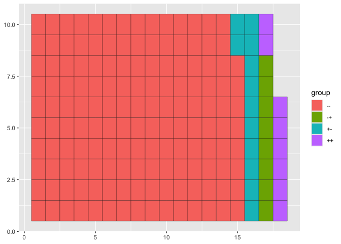

# Lab 3: Key


Consider data from on co-infections of Australian Flying Foxes in the
paper [Synchronized seasonal excretion of multiple coronaviruses
coincides with high rates of coinfection in immature
bats](https://www.nature.com/articles/s41467-025-61521-7). In this
paper, we studied co-infections of different coronavirus clades in 176
juvenile flying foxes. Of those,

- 148 bats tested negative for both clades
- 12 tested positive for clade iv but negative for clade v
- 8 tested positive for clade v but negative for clade iv
- 8 tested positive for both clades

``` r
n <- 176
```

#### 1. (4 points)

Use the `waffle` package to visualize the four outcomes. Add a short
caption to your figure. Note you might need to install `waffle` from
GitHub.

``` r
#devtools::install_github("wch/Rttf2pt1")
#devtools::install_github("wch/extrafont")
#devtools::install_github("hrbrmstr/waffle")
library(waffle)

tibble(group = c('--', '+-', '-+', '++'),
       vals = c(148, 12, 8, 8)) |>
  ggplot(aes(fill = group, values = vals)) +
  geom_waffle()
```



#### 2. (2 points)

Create a 2-by-2 contingency table with the results. Note in the
analysis, we used the following row / column structure.

|     | IV - | IV + |
|:----|:-----|:-----|
| V - |      |      |
| V + |      |      |

|     | IV - | IV + |
|:----|-----:|-----:|
| V - |  148 |   12 |
| V + |    8 |    8 |

#### 3.

#### 3.1 (2 points)

Use maximum likelihood to calculate point estimates of marginal
probabilities of a positive result for each virus.

$Pr[IV(+)]:$ = 11.4%

$Pr[V(+)]:$: = 9.1%

#### 3.2 (4 points)

Use maximum likelihood to calculate the conditional probabilities for
positive result for each virus.

- $Pr[IV (+) |V(+)]$
- $Pr[IV (+) |V(-)]$
- $Pr[V (+) |IV(+)]$
- $Pr[V (+) |IV(-)]$

#### 3.3 (4 points)

Recall that statistical indendence implies that $\pi(A) = \pi(A|B)$. In
question, 3.2, we have estimates of $\pi$. Without a formal hypothesis
test, do you think that getting a positive test for one clade is related
to getting a positive test in the other clade?

#### 4.

#### 4.1 (4 points)

Revisit 3.1 and estimate these marginal probabilities with appropriate
uncertainty intervals. You are welcome to use MLE or Bayesian
approaches.

$Pr[IV(+)]:$ = 11.4%

$Pr[V(+)]:$: = 9.1%

#### 4.2 (4 points)

Compute an uncertainty interval for the difference in these
probabilities in part 4.1.

#### 5

#### 5.1 (4 points)

Use a $\chi^2$ test to determine whether positivity across the two
clades is related.

#### 5.2 (4 points)

Write a paragraph describing the results from 5.1 in the context of the
scientific research question.
